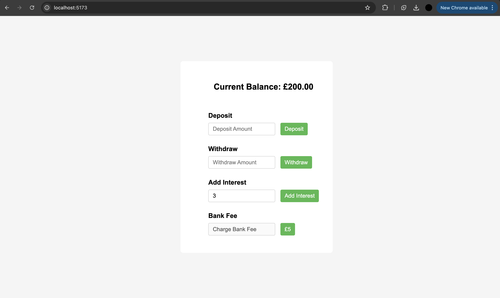

# React Interest Calculator

## Description
This is a **React-based banking system simulation** built with **Vite** that allows users to:
- View their current bank balance.
- Deposit and withdraw money.
- Apply interest to the balance.
- Charge bank fees.
- Receive alerts when the balance goes negative.

This project is important for learning:
- Handling user inputs in React.
- Managing **state lifting** and sharing between components.
- Performing dynamic calculations using **React Hooks**.
- Styling with **Bootstrap**.

---

## Table of Contents
1. [Installation](#installation)
2. [Usage](#usage)
3. [Features](#features)
4. [Screenshots](#screenshots)
5. [Credits](#credits)

---

## Installation
Follow these steps to run the project locally:

1. **Clone the repository:**
```bash
git clone https://github.com/ibtisam3/codingTasks.git
   ```

2. **Navigate into the project folder:**

```bash
cd codingTasks/react-interest-calculator
```

3. **Install dependencies:**
```bash
npm install
```

3. Run the project:
```bash
npm run dev
```

## Usage
- **Deposit Money**: Enter an amount and click **Deposit** to increase the balance.
- **Withdraw Money**: Enter an amount and click **Withdraw** to decrease the balance.
- **Add Interest (£5 Fixed Rate)**: Click **"Add Interest"** to add a fixed **£5** to the balance.
- **Charge Bank Fees**: Click **"Charge Fees"** to deduct a fixed amount or percentage from the balance.
- **Negative Balance Alert**: If the balance goes negative, an alert is triggered.


Features
✅ Uses React Hooks (useState) for state management.
✅ Implements state lifting to share data between components.
✅ Styled with Bootstrap for a clean UI.
✅ Real-time balance updates with every transaction.
✅ Built with Vite for fast performance.

## Screenshots
Below is a screenshot of the React Interest Calculator in action:



## Credits
This project was created by [Ibtisam](https://github.com/ibtisam3).  
